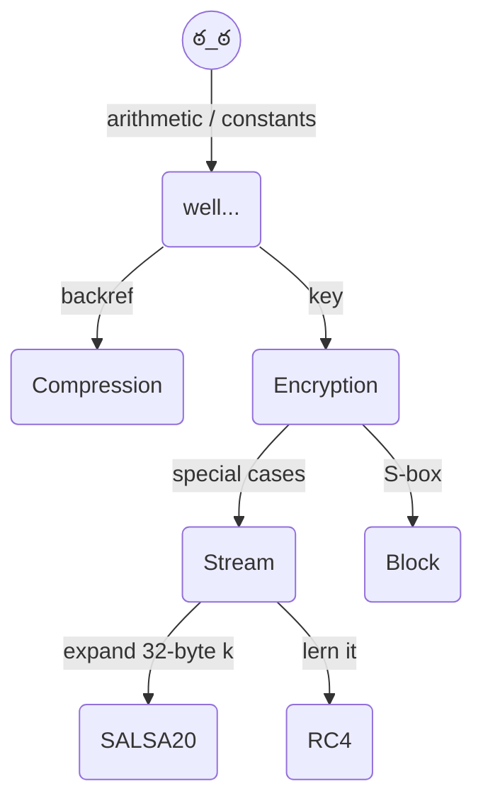

```mermaid
graph TD
You((ఠ_ఠ)) -- arithmetic / constants --> A(well...)
A  -- backref --> C(Compression)
A -- key --> Crypto(Encryption)
Crypto -- special cases --> D(Stream)
D -- expand 32-byte k --> SALSA(SALSA20)
D -- lern it --> RC4(RC4)
Crypto -- S-box --> E(Block)
```