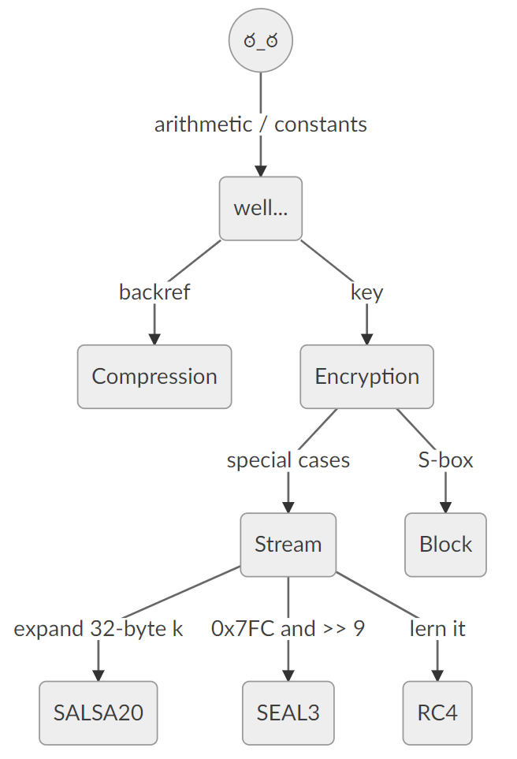

# Introduction

## What is Reverse Engineering?

In the context of software, reverse engineering is the process of recovering an abstract description of how a program operates. In many cases, the reverse engineer has nothing to work with except for a compiled binary, which is also the situation we will focus on.

One important discipline of reverse engineering is _dynamic_ analysis, which focuses on studying the behaviour of a program during execution, often by means of a debugger. Conversely, _static_ analysis is the art of deducing program logic by pure deductive reasoning from the code. In reality, a hybrid approach is widely considered to be most efficient.

There are many tools available to translate the machine code of a given binary into easier to read types of code. The first step is usually to recover the assembly code. Up until recently, there was no freely available software to recover high-level code. On March 5th, 2019, the NSA publicly released their _decompiler_ and made it freely available: It is called _Ghidra_ and is pronounced the way it is spelled.

Ghidra transforms machine code into C-like code. The remaining task of a reverse engineer becomes refactoring of this code in order to improve its readability. In many cases, this makes it possible to deduce the internal logic of a program without reading assembly language. The time saved in this way is quite considerable, and it also lowers the entry barrier for up and coming reverse engineers.

One important application of software reverse engineering is the analysis of malicious programs. We focus here on reverse engineering of Windows malware because it is quite simply the most prevalent threat.

## What don't we do?

The course does not cover the following topics:

- Headless Ghidra automation
- Malware that is not Windows malware
- Any software that is not malware
- MSIL malware (because it is not compiled (ಠ_ಠ))
- Malware unpacking

Furthermore, the binaries analyzed during the course will usually have been compiled with a C/C++ compiler and were not originally written in other languages such as Delphi, GoLang, or VB. We mention these languages in particular because they are popular choices among malware authors.

## Alternatives to Ghidra

The industry standard for binary reverse engineering is [IDA][], using the [HexRays Decompiler][]. However, these are not exactly cheap. Before the release of the Ghidra, the only alternatives were [RetDec][] and [Hopper][], but both of these are arguably less powerfull than Ghidra and IDA. Given these considerations, we consider Ghidra the best choice for entry level reverse engineering.

## Motivations for Reverse Engineering

There is a number of reasons to reverse engineer software in general:

- Quality assurance: _"Does it do what it is supposed to do?"_
- Interoperability: A wild undocumented binary blog appears.
- Educational purposes: A welcome excuse to hack.
- Malware analysis: Understand The Bad Guys™.
- Exploit development: _"Are there bugs? Can I exploit them to make it behave in a way it was not intended?"_
- Cracking: Circumvent copy right protection.
- Economic espionage: Steal intellectual property.

We are not lawyers, but we believe the above list to roughly be sorted by how nefarious the purpose is.

## Types of Malware

Classifying malware is a desaster. Here is our miserable attempt:

### Stagers

A _stager_ is anything whose primary goal is to eventually deliver additional malware, which is referred to as the _next stage_. We roughly classify stagers as one of the following:

- Downloader
- Dropper
- Loader

A _downloader_ retrieves the next stage from a remote host in some way while a _dropper_ already contains the next stage. A _loader_ is similar to a dropper but does not write the next stage to disk; instead it executes it in memory.

### Final Stages

The following are some possible final stages of a malware deployment:

- Backdoor
- Remote Access Tool
- Bot
- Rootkit
- Bootkit
- Banker
- Stealer
- Ransomware
- Mineware
- Wiper

We try to give a brief description of all of these, but note that the lines between these terms are quite blurry. Any malware can be one, or multiple, or not quite any of the above.

A _backdoor_ is the most rudimentary malware; it simply offers some way to gain access to the infected system. Common types of backdoors are connect-back shells or bindshells, or even more simple tools that can execute arbitrary commands. A _Remote Access Tool_ (RAT) is any malware that implements remote access to the operating system. The scope and extent of this access is left intentionally vague but may include things such as file system access, registry modification, command execution, upload, download, and remote desktop capabilities.

Malware is referred to as a _bot_ not primarily because of its capabilities, but because of its large-scale distribution and operation: All the bots together form a _botnet_, and bots are often used to perform tasks for which it is useful to have control over a large number of machines: DDoS, spam mailing, etcetera.

The definition of a _rootkit_ is among the more testy subjects. We will quote Wikipedia:

> A rootkit is a collection of computer software, typically malicious, designed to enable access to a computer or an area of its software that is not otherwise allowed (for example, to an unauthorized user) and often masks its existence or the existence of other software.

The most infamous rootkits are so called _kernel-mode_ rootkits which nest in the operating system kernel to hide nefarious processes, files, and even network activity. A _bootkit_ is malware which persists in a different memory area than RAM or hard disk, thereby becoming resistent even against reinstallation of the OS.

The primary purpose of a _banker_ is to steal money by interfering with the communication between the victim and their online banking provider. The details of this can range from simple social engineering techniques to complex frameworks that act as a man in the middle. The term _stealer_ refers to malware that primarily exfiltrates information, documents, and credentials. _Ransomware_ encrypts all your files and demands ransom for them. That's about it. In contrast, a _wiper_ is a program that simply destroys data irrecoverably, usually by deleting files or overwriting them with junk. The arguably most friendly way to monetize infected systems is _Mineware_ which steals computational resources to mine blockchain-based currencies.

Some malware is produced by so-called _Builders_. While these are not precisely malware, they may contain malware stubs and are arguably related to it.

### Where to Get The Malware

- Use malware repositories:
  - Get a job in the industry to get access to [VirusTotal][].
  - If that is not an option, use [MalShare][] or [URLhaus][]
- Sometimes, friendly cyber criminals just send you malware. Keep an eye on your inbox.
- If you are very important, you might even get targeted malware. Lucky you!

# A Few Hints

- You should import [our keybindings](../ghIDA.kbxml). These [keybindings](../ghIDA.kbxml) strive to be as close as possible to the [IDA][] keybindings because we are used to them. Also, they are good. Look, if you use different keybindings, this will only be confusing during the course! Just import [the damn keybindings](../ghIDA.kbxml)!
- Variables are a concept not present in machine code. Ghidra tries to map memory regions to variables in the decompiled code and may change this mapping after each of your operations. If these changes get in your way (and they will), we recommend forcing Ghidra to fix the current mapping by selecting the entry **Commit Locals** from the decompiler context menu.
- Select **Edit → Tool Options → Listing Fields → Cursor Text Highlight** and switch it from middle mouse button to left mouse button. This way, when you click on a symbol, it will highlight all other occurrences.
- If you are running Linux, editing `support/launch.properties` in the Ghidra directory and changing `VMARGS=-Dsun.java2d.opengl=false` to `true` yields a massive performance improvement.

# Our First Sample - The Basics

Open the binary with Ghidra, and open it in the decompiler. Let Ghidra analyze it. For a top-down approach, use the `Symbol Table` or `Symbol Tree` to find the function called `entry` (the executable entry point) and navigate to it. This is the code that is executed when the program starts. As a first sample, we will investigate the file with the following SHA-256 hash:
```
9f613a49d893d030c450186ef3abbac92fe068c84f94858620972781e15d86fe
```

## The Windows API

When we look at its entry point, we see function calls named `GetProcessHeap`, `HeapAlloc`, and `GetWindowsDirectoryW` which are highlighted in a dark shade of blue. These are calls to Windows API functions, i.e. these are functions that are provided by the Windows OS. To understand what they do, you will have to refer to the [MSDN Library][]. If you are on Windows, then you can refer to [this blog article][NTF-MSDN] for how to obtain an offline copy of this API reference. Sadly, we do not know of any cross-platform alternative at this point in time. However, it is quite efficient to simply Google the name of the API function and take the first hit.

There are some Windows API naming conventions worth mentioning: Often, there are two versions of the same function; one ending with the letter `A` and one ending with the letter `W`. The former stands for "ASCII" while the latter stands for "Wide", and it means that the former version of this function works on 8-bit ASCII strings while the latter works on 16-bit wide character unicode strings (UTF-16 Little Endian without BOM, if you want to be precise). Furthermore, some functions have extended variants which are suffixed with `Ex`, for example `VirtualAlloc` and `VirtualAllocEx`.

## Renaming Variables

Having understood that `GetWindowsDirectoryW` retrieves the path to the Windows directory, we can proceed to rename the variable `DAT_140003208` as `WINDOWS_DIRECTORY`. To do so, right-click the variable and use the **Rename Global** option. In the menu, you will also note the keyboard shortcut for this operation. Remember it and never use the menu option again. When we encounter a reference to this variable later in our analysis, we will know what it is. It is generally recommendable to choose good names for every variable and function that we have understood; reverse engineering is quite similar to refactoring a really horribly written legacy codebase. Note however, that you will not always have a good understanding of every variable and function right away - in this case, it is often a good idea to give it _some_ name, so that you recognize it later when it occurs in a different context. This can help you to give it a good name later.

For example, as we proceed to investigate the purpose of the next function `BCryptOpenAlgorithmProvider`, it occurs to us that we (possibly) have no idea what this is all about. Sometimes, in reverse engineering, it is important to skip over certain parts and continue with the code that comes after in the hope to fill the gaps later. If you do not quite understand what `BCryptOpenAlgorithmProvider` does; simply continue. But it's probably something with crypto. Could this be ransomware? Let's rename the variable `DAT_140003420` to `STH_WITH_CRYPTO` and worry about this later. The convention here is that we prefix unknown globals with `STH` for _"something"_.

## Changing Types

Furthermore, the decompiler sometimes does not guess the correct type for a variable or openly admits that it has no idea, in which case Ghidra will denote the type as `undefined`. Sometimes, Ghidra will indicate the size of the variable in bytes, i.e. `undefined4`. See also the entry **Ghidra Functionality → Program Annotation → Data → Data Types** in the Ghidra manual. Especially function signatures are often incomplete and sometimes wrong, in which case you can (and should) fix them. Unfortunately, there is no foolproof receipe for figuring out the correct types. Usually, you formulate hypotheses about the context in which variables and functions are used, then change types according to these hypotheses, and keep challenging until they break down and you have to start all over again - or you get lucky and it all makes sense.

## Naming Constants

The Windows API also specifies a large amount of named constants which appear as parameters to the various function calls you will encounter. In the decompiled code, these constants appear as numeric literals, which is somewhat hard to understand. Luckily, Ghidra has a (more or less) convenient way to replace such constants by a name under which they appear in the Windows API headers. Sadly, at the time of writing, you can not do this in the decompiler view - you will have to locate the constant in the disassembly. Once you have found it, right click it and select the context menu entry **Rename Equate** to bring up a dialog where you can search for known names matching this value.

For example, the function at offset `0x14000168c` contains a call to `GetVolumeInformationW` and one of its return values is checked for having the flag with value `0x80000` set. The corresponding check in the disassembled  code occurs at `0x14000172c`:
```
14000172c       TEST          dword ptr [RBP + lpFileSystemFlags[0]], 0x80000
140001736       JZ            LAB_14000173f
```
In this case, we right-click the value `0x80000` and search for `FILE`. Then, we guess that it is probably the flag called `FILE_READ_ONLY_VOLUME`.

## Using Comments

Akin to code design in software development, you will sometimes face the problem that renaming and restructuring alone will not make the code comprehensible enough. In these cases, using a comment is your best bet - you can add comments in Ghidra's decompiled view by right clicking a code line and selecting the context menu entry **Comments → Set…**.

## Internal Decompiler Functions

Sometimes Ghidra refers to implicitly defined functions (or macros, if you will), which are documented under **Ghidra Functionality → Decompiler → Internal Decompiler Functions**. One you might encounter while analyzing this particular sample is `CONCAT44(x,y)` where `x` and `y` are both variables which are 4 bytes in size. The macro represents their bitwise concatenation as an 8-byte variable. If you come across other all-caps macros that are unknown to you, refer to the reference manual.

## Lessons to be Learned

While analyzing a sample in a top-down manner, i.e. by starting at the entry point and following function calls, there are some functions that will give you a hard time. In some cases, you should simply skip them, possibly make an educated guess at what their purpose may be, and continue analysis at a higher level in the call tree. This can save a lot of time because the purpose of a function can sometimes be completely clear from context - and therefore you can try to first acquire this context.

# Second Sample - The Real Deal

Next, we analyze the sample with the following SHA-256 hash:
```
050f88ce73dbfc7cc3b3fd36357e5da48c61d312be45fec8d64c0c22e61c2673
```
This is a piece of crimeware from 2017, so a little aged, but the real deal nevertheless.

## Common Tasks of Malware Reverse Engineers

Your job is to figure out all the evil things it does. As you can arguably spend an arbitrary amount of time reverse engineering almost any piece of malware if it is complex enough, it is useful to have specific goals in mind for an analysis. When reverse engineering is your day job, you will usually receive some form of direction, but this direction can be fairly abstract and you are left to define more specific goals in your own research. Here is a non-exhaustive list of such tasks.

- Determine whether a given sample even is malicious
- Recover indicators of compromise (IOC)
  - Command and control (C2) servers
  - File paths
  - Mutex names
- Design signatures
  - Snort (network communication), i.e. User-Agent strings
  - YARA: binary patterns
- Describe malware features
- Identification (at least partly, if possible)
  - Using signatures or code overlaps with known software, cluster malware into families
  - Construct a timeline for malware activity, identify versions or campaigns
- Understand programming styles: Experience, habits and skill level of the author
  - Libraries
  - Programming patterns
  - Uncommon techniques
    - Non-standard implementations for algorithms
    - Unique magic constants
  - Reimplementations of standard algorithms
  - Tendency to use static or dynamic linking
  - Prefences for certain APIs

## Reversing Styles

While we analyzed the first sample from top to bottom by starting at the entry point, it is also possible to follow a bottom-up approach. This involves starting at a spot in the code where something _"interesting"_ happens and attempting to understand the code _locally_ around this spot. If the lead turns out to be as interesting as you thought, you can then work your way up the call chain to see how it fits into the bigger picture. Here are a few examples of what can make for an interesting spot to start.

- Use the **Imports** section of the **Symbol Tree** view in Ghidra to obtain a list of all Windows API calls that the program references. Some are more interesting than others. For example, the given sample imports `InternetOpenUrlA`, which indicates that some HTTP shenanigans are going on. This might be interesting. Or not.
- Select **Defined Strings** from the **Window** menu in Ghidra to obtain a list of memory regions that look like printable strings.
- This may not be of relevance right now, but if you discover malware by means of (some kind of) signatures, it might be interesting to start at the spot where that signature triggered.

One final, mildly esoteric point to touch on is the distinction between a _deductive_ and an _inductive_ approach to the analysis. A deductive approach means that you deduce new analysis resutls logically, strictly from facts that you already know about the program. For example, when you see a call to `GetWindowsDirectoryW`, you can deductively rename its first parameter to `WindowsDirectory`. Inductive reasoning requires the formulation of hypotheses, i.e. you have to make an educated guess, and then _try to rigorously test this hypothesis_. In natural sciences, the primary goal is to falsify assumptions, but in reverse engineering it is ok to also try and verify them. After all, this is not _quite_ as empirical. For example, the function at offset `0x14000111c` in our first sample seemed - from context - to be responsible for taking ownership of an otherwise inaccessible file. Analyzing the routine did not yield any contradiction and so eventually we settled on accepting this hypothesis as truth.

We have already mentioned briefly that malware reverse engineering involves a lot of dynamic analysis in reality, and this is also an important distinction - but we will not speak about it here. Here is a list of the different dimensions you should be able to traverse as a skilled reverse engineer:

- Dynamic _vs._ Static
- Deductive _vs._ Inductive
- Top Down _vs._ Bottom Up

It goes without saying (but we'll say it anyway) that in neither of these cases, either option is strictly better or worse. It depends on context, and also on personal preference.

# Different Kinds of Code

## Portable Executables

We have seen the code of two Windows executables already, but it is worth noting that these files do not consist exclusively of machine code. They are files in the _Portable Executable_ (PE) format. These files always begin with the sequence `MZ`, followed by a chunk of meta information which is called the _PE Header_. The so-called _PE Loader_ is a component of the Windows OS which reads this information and turns the executable on disk into a _process_ in memory. Among several other things, the header contains information about:

- the memory layout of this process,
- the Windows API routines that are referenced by the code,
- the address of the _entry point_, which points to the code where the process begins executing.

A PE file has several _sections_, one of which contains the executable code. This section is normally called `.text` and contains the entry point. There are other frequent fliers such as `.data`, `.rdata`, `.rsrc`, and `.reloc`. We will not go into detail about what they are used for; they are placed in memory by the PE loader and Ghidra will emulate this mapping.

The header also contains information about the _Dynamic Link Libraries_ (DLLs) required by the executable. These DLL files are also PE files, and the PE loader loads them into the same memory space. Ghidra can emulate this as well: When importing a file, click **Options** and check **Load External Libraries** (potentially edit the import paths) to make Ghidra follow Win32 API imports into the corresponding DLLs. If you have a Windows OS, you can use the DLLs from that machine. Alternatively, we provide DLLs from a copy of [ReactOS][], which is a free and open source Windows clone.

These DLLs need to be loaded so that the process can call the Windows API functions we have seen before: The code for each of these functions resides in a system DLL.

## Shellcode

It is possible to write code that does not depend on its position in memory. This is the kind of code that usually gets executed by exploits and for this historic reason, it is called _shellcode_. Some nitpicking pipe smokers will insist that it should be called _position-independent code_, but we'll call it shellcode.

Sometimes, certain stages of a malware chain are implemented as shellcode. The main reason for this is to easily execute these stages in memory without touching the disk: The buffer containing the shellcode can be called just like a function. Note that memory in Windows can have read/write/execute permissions, and there are not many other reasons to make a memory region executable. This can happen in a call to `VirtualAlloc` or `VirtualProtect`, for example.

Identification of functions in binary code is a hard problem and decompilers like Ghidra use different techniques and heuristics to try to solve it. Especially when working with shellcode, these solutions sometimes fail and Ghidra doesn't correctly identify functions or even executable code as such. In these cases, you can always right-click in the Listing view and select **Disassemble** to mark memory as code and then right-click and **Create Function** to trigger decompilation.

# Obstacles

## String Obfuscation

As we saw in the second sample, plaintext strings in malware can give away a lot of information. Some malware authors care about making our job hard and therefore want to avoid this. A very common technique to conceal strings is to _obfuscate_ them, usually by means of encoding them. Sometimes, this involves the use of cryptographic algorithms with hard-coded keys. Hexadecimal and base64 encoding as well as XOR-based encryption algorithms are so easy to spot that you should keep an eye out for them.

When strings are obfuscated, they need to be decoded first before the malware can use them. More often than not, this is done by a single function. Finding and reverse engineering that function, and consequently decrypting all the strings, can mean a quantum leap in your understanding of the malware.

The following is a string decryption function from the malware sample with SHA-256 hash
```
cc8867a5fd62b82e817afc405807f88716960af5744040999b619b126a9ecf57
```
and rather simple; it was intentionally not refactored to give an impression of how this would look in Ghidra.
```
void * __cdecl FUN_00401430(char *param_1)
{
    void *pvVar1;
    size_t sVar2;
    uint uVar3;

    uVar3 = 0;
    pvVar1 = calloc(1,0x1b);
    while( true ) {
        sVar2 = strlen(param_1);
        if (sVar2 <= uVar3) break;
        *(byte *)((int)pvVar1 + uVar3) = param_1[uVar3] ^ 3;
        uVar3 = uVar3 + 1;
    }
    *(undefined *)((int)pvVar1 + uVar3) = 0;
    return pvVar1;
}
```
It takes the input string `param_1` and XORs each byte with the constant key `0x03`.

As an exercise in string obfuscation, we recommend extracting the C2 servers from the sample with SHA-256 hash
```
2396c9dac2184405f7d1f127bec88e56391e4315d4d2e5b951c795fdc1982d59
```
by using a bottom-up approach starting at calls to `InternetConnectA`.

## Stack Strings

Independent of the above, strings can be obfuscated by simply not storing them as a consecutive buffer of bytes. Instead, the string is constructed by a sequence of machine code instructions. The first known implementation of this technique was to assemble strings on the _stack_, which is a datastructure present on many architectures. For this reason, this method is referred to as _stack strings_. They can often be spotted in Ghidra as many consecutive single byte value assignments:
```
  local_78 = 0x56;
  local_77 = 0x69;
  local_76 = 0x72;
  local_75 = 0x74;
  local_74 = 0x75;
  local_73 = 0x61;
  local_72 = 0x6c;
  local_71 = 0x41;
  local_70 = 0x6c;
  local_6f = 0x6c;
  local_6e = 0x6f;
  local_6d = 0x63;
  local_6c = 0;
```
To turn these byte values into readable letters, switch to the **Listing** window (the disassembly), which will look like this:
```
  0000000c       MOV           byte ptr [EBP + local_78], 0x56
  00000010       MOV           byte ptr [EBP + local_77], 0x69
  00000014       MOV           byte ptr [EBP + local_76], 0x72
  00000018       MOV           byte ptr [EBP + local_75], 0x74
  0000001c       MOV           byte ptr [EBP + local_74], 0x75
  00000020       MOV           byte ptr [EBP + local_73], 0x61
  00000024       MOV           byte ptr [EBP + local_72], 0x6c
  00000028       MOV           byte ptr [EBP + local_71], 0x41
  0000002c       MOV           byte ptr [EBP + local_70], 0x6c
  00000030       MOV           byte ptr [EBP + local_6f], 0x6c
  00000034       MOV           byte ptr [EBP + local_6e], 0x6f
  00000038       MOV           byte ptr [EBP + local_6d], 0x63
  0000003c       MOV           byte ptr [EBP + local_6c], 0x0
```
Then, place your cursor over the first byte value `0x56` and use the option **Convert → Char** from the context menu. Remember the shortcut (which should really be `R` if you imported [our delicious keybindings](../ghIDA.kbxml)). Now, repeatedly press the down arrow key followed by that shortcut. That's your life now.

## Packing

Samples can be _packed_, which means that they have been compressed, encoded, encrypted, or arbitrary combinations of these. Packed samples require additional code to execute. Hence, these files are usually loaders or droppers. Since we have reserved these terms for malware, it is worth pointing out that there are also packers like UPX whose intended purpose is to reduce the size of an executable and which are used just as well by legitimate software authors.

The program used to pack a sample is referred to as a _packer_. Some people use the term exclusively for tools that use compression as the only means of obfuscation, and use the terms _crypter_ or _protector_ for other variants. We don't.

Packing is a very convenient method of obfuscation: It allows the malware author to use their comfort zone toolchain in development and obfuscate the sample by simply applying a packer to it. Packed samples can be notoriously hard to reverse engineer when the packer stub has been made subject to additional obfuscations that we will discuss below. However, the weakness of packing as an obfuscation technique is the fact that at some point during execution, the unpacked sample will be in memory or on disk. The universal solution to defeat this technique is therefore dynamic analysis, which we will get into later.

## Control Flow Obfuscation

We refer to _control flow obfuscation_ as any obfuscation technique that alters the control flow of code with the intention to make it more resilient against static analysis. For example:

- **Junk Code**: Insert additional instructions into the code that don't alter its behavior.
- **Function Chunking**: Split a function into parts, shuffle these around, and connect them with jumps.
- **Opaque Predicates**: Make code branches depend on information that is constant, but not easily identified as such. For example, check whether `GetTickCount` API returns a value greater than `4`. Or check whether `(5 + 7)` equals `(3 * 2 << 1)`.
- **Return-Based Calls**: Use the `RET` assembly command to call a function. Ignore this if you don't know assembly, or read up.
- **Exception Handler Hijacking**: Hijack those exception handlers! And throw some exceptions.

Only the first of these techniques is present in the packed sample with the following SHA-256 hash:
```
ad320839e01df160c5feb0e89131521719a65ab11c952f33e03d802ecee3f51f
```
It is your exercise to extract the shellcode second stage of this loader.

## Runtime API Lookups

Instead of listing required API functions as an imported symbol, the malware can use the `LoadLibrary` and `GetProcAddress` API calls to load DLLs into memory and retrieve the addresses of required functions at runtime. The malware may even go one step further and implement a variant of `GetProcAddress` which uses hashes instead of function names; this is referred to as _API hashing_. Finally, the malware may even go _another step futher_ and avoid using `LoadLibrary` and `GetProcAddress` by parsing the PE header of DLLs which are already present in memory. In practice, the following observation helps to identify when shenanigans like this are taking place. If the variable `ptr` points to the beginning of a DLL, then
```
(ptr + *(int *)(ptr + *(int *)(ptr + 0x3c) + 0x78))
```
points to its list of exported functions.

It is out of scope for this lecture to cover the Windows PE file format exhaustively, but it is vital for an experienced Windows reverse engineer to be able to Google it properly. If you want to know exactly how the PE header looks like, we recommend the [PE Format Cheat Sheet][PECheat].

## Meta Data Deception

- Deceptively naming symbols
- Timestomping

## Compiler Optimizations

- Loop unrolling
- Inlining
- Constant Folding

## Advanced Obfuscation Techniques

- Control Flow Flattening
- Virtualization
- Polymophism
- Metamophism

# Data Types and Structures

## Data Types

Compilers translate high-level languages, like C, into assembly instructions. There is no concept of data types on the assembly level, just data and instructions. Decompilers analyze the way in which these assembly instructions operate on the data and attempt to heuristically deduce the original data types. Since these types are just guesses, there might sometimes be better choices and it is your sworn duty as a reverse engineer to ever seek those out. For example, the decompiler sometimes defaults to passing arguments as `int` even though they might actually be pointers. For example, you might see the following code:
```c++
DWORD __cdecl FUN_00409db0(int param_1,int param_2)
{
  char *_Str1;
  int iVar2;

  if (param_1 == 2) {
    _Str1 = *(char **)(param_2 + 4);
    iVar2 = _stricmp(_Str1, "-svc");
    if (iVar2 == 0) {
      InterestingStuffHappens();
    }
  }

  return 0;
}
```
Notably, the decompiler thought it necessary to cast `param_2 + 4` into a pointer to a pointer to a `char` so that `_Str1` would have the correct type as an argument to the `_stricmp` function. This should really tell you that `param_2` is, in fact, of type `char**`. Changing the type makes the code look much more sensible:
```c++
DWORD __cdecl FUN_00409db0(int param_1,char **param_2)
{
  char *_Str1;
  int iVar2;

  if (param_1 == 2) {
    _Str1 = param_2[1];
    iVar2 = _stricmp(_Str1, "-svc");
    if (iVar2 == 0) {
      InterestingStuffHappens();
    }
  }

  return 0;
}
```

## Structures

This problem becomes significantly more challenging when the best data type is actually an unknown structure. For example, consider the sample with the following SHA-256 hash:
```
050f88ce73dbfc7cc3b3fd36357e5da48c61d312be45fec8d64c0c22e61c2673
```
Remember? This is the second sample we looked at. At `0x00405810`, there is a call to `0x004040e0` and access to memory around `0x0040b030`. It should look roughly like this in Ghidra:
```c++
uint local_8;

/* ... */

if ((&DAT_0040b030)[local_8 * 2] == NULL) {
  local_8 = 0;
}
s = FUN_004040e0((&DAT_0040b030)[local_8 * 2],*(u_short *)(&DAT_0040b034 + local_8 * 8));
if ((int)s < 1) {
  local_8 += 1;
}
```
Notice that there is an array access to the memory at `0x0040b030`, but the index variable is multiplied by two. This indicates that the array actually contains chunks of data where each chunk consists of two machine-word-sized variables, i.e. it is an array of structs. Let's create a structure in Ghidra that has two machine-word-sized fields. To do so, go to **Data Type Manager**, right-click the entry that corresponds to the open sample, **New**, **Structure**. If you are using our keyboard shortcuts, you can also create a new structure by simply pressing the **Insert** key while the **Data Type Manager** has focus.

This should open the **Structure Editor** for a new structure. Add two fields to it, change the name to, say, `c2_t`, and save the structure. After this is done, navigate to `0x0040b030` and change the type of the global variable at this location to, say `c2_t[2]`; we can figure out the correct size of the array later. Beware of Ghidra's data type chooser, which often tries to aggressively suggest false data types. After changing the data type, the code should look more like this:
```c++
if (DAT_0040b030[local_8].field_0x0 == 0) {
  local_8 = 0;
}
s = FUN_004040e0((char *)DAT_0040b030[local_8].field_0x0,*(u_short *)&DAT_0040b030[local_8].field_0x4);
if ((int)s < 1) {
  local_8 += 1;
}
```
This now tells us that the two fields of the data structure are likely of type `char*` and `u_short` (plus a two-byte alignment padding). You can simply change the type of the fields inside the decompiler window and end up with this:
```c++
if (DAT_0040b030[local_8].field_0x0 == NULL) {
  local_8 = 0;
}
s = FUN_004040e0(DAT_0040b030[local_8].field_0x0,DAT_0040b030[local_8].field_0x4);
if ((int)s < 1) {
  local_8 += 1;
}
```
After some additional reverse engineering, you will figure out that the first field is a pointer to the C2 server host name, and the second field contains the port number on which to connect. After you are done with this code segment, it could therefore look like this:
```c++
if (C2LIST[k].Host == NULL) {
  k = 0;
}
socket = EvConnectC2(C2LIST[k].Host,C2LIST[k].Port);
if ((int)socket < 1) {
  k += 1;
}
```

## Complex Structures

In general, data types may be more complex, especially including nested structs. And while automatic discovery across an entire binary is a theoretically solved problem, any such implementation still doesn't properly work in practice at the time of writing. To ease creation of larger structures involving lots of fields, Ghidra offers a feature for automatic structure creation which only takes the current function into account: you can right-click any variable and select **Auto Create Structure**. Note that this feature works only on _pointers_ to structures. It likely works by looking up pointer arithmetic followed by dereferencing. As an example, recall the obfuscated loader with the following SHA-256 hash:
```
ad320839e01df160c5feb0e89131521719a65ab11c952f33e03d802ecee3f51f
```
If you were successful in extracting the second stage shellcode, it should have the following SHA-256 hash:
```
ed356e738dea161f113c33be8e418d52a468c6ff67c0fd779096331cd12152d5
```
This shellcode starts with a function that accepts a single pointer argument which points to structured data. Using the **Auto Create Structure** feature on this parameter will save you a few clicks. Of course, you still have to rename and retype the fields of this structure to make sense of it.


# To Do as Cypher Does

> You get used to it. I…I don’t even see the code. All I see is blonde, brunette, red-head. Hey, you uh… want a drink?

The most complex algorithms that occur in malware reverse engineering are arguably cryptographic primitives and (de)compression algorithms. Of course, recognizing the algorithm is rather easy when it is based on an API call. The next best thing is a statically linked library, because they often contain copyright strings that clearly identify their purpose. For example, if you see something like this:
```c++
if ("- unzip 0.15 Copyright 1998 Gilles Vollant "[1] == ' ') {
    // ...
}
```
then you are probably looking at unzip code. However, this is not always the case, and identifying the algorithm in question can be a massive road block in your analysis.

The first step is to realize that you are looking at a cryptographic or compression algorithm at all. Needless to say, there is no magic receipe, but a few dead giveaways anyway. For example, horrendous amounts of arithmetic operations (especially shifts and XOR) should tip you off. Another clue are oddly specific looking, large numeric constants. The following code has both:
```c++
uVar1 = iVar2 + 0xd76aa478 + (~uVar9 & uVar2 | uVar12 & uVar9) + local_50;
uVar3 = (uVar1 >> 0x19 | uVar1 * 0x80) + uVar9;
uVar2 = uVar2 + 0xe8c7b756 + (~uVar3 & uVar12 | uVar9 & uVar3) + local_4c;
uVar5 = (uVar2 >> 0x14 | uVar2 * 0x1000) + uVar3;
uVar2 = uVar12 + 0x242070db + (~uVar5 & uVar9 | uVar5 & uVar3) + local_48;
uVar7 = (uVar2 >> 0xf | uVar2 * 0x20000) + uVar5;
```
The key goal for you should be to identify the algorithm as quickly as possible. Here are a few inside and outside the box ideas:

- If the routine processes data and you are able to identify the file format of that data, it can be possible to deduce the algorithm.
- If you find characteristic numeric constants, smashing them into Google usually gives you the answer you seek.

If you have nothing to hold on to right away, we recommend the following approach. We will outline the details of each of these below.

1. Determine whether the algorithm is compression, encryption, boring framework code, or something else.
2. If it is something interesting, reverse it just long enough to find another clue to search for on the internet. It can help to have reverse engineered the routine well enough to recognize a pseudocode description of it when you find one.
3. Once you have identified an algorithm, commit everything you saw to memory forever and be able to identify this algorithm for all eternity.

## Identifying Compression Algorithms

If you are already quite certain from context that the algorithm processes blobs of unintelligible data, i.e. you are convinced that it is decompression or decryption, then the absence of an encryption key is solid evidence that you are dealing, in fact, with a (de)compression algorithm. Note however that an encryption key doesn't always have to be passed as an argument to the function but could also be generated in some other way.

Another algorithmic indicator for decompression algorithms is the presence of pointer arithmetic with negative offsets, i.e. a back reference into already decompressed data. For example, consider the following excerpt from a decompiled APLib decompression routine:
```c++
if ((local_8 == 0) && (iVar3 == 2)) {
  local_18 = local_10;
  local_14 = FUN_00000900(&local_2c);
  while (local_14 != 0) {
    *decompressed = decompressed[-local_18];
    decompressed = decompressed + 1;
    local_14 += -1;
  }
}
```
Note particularly the 5th line where `decompressed[-local_18]` is a backwards reference. This happens specifically for LZ-type compression algorithms; note that decompression based on a Huffman tree does not necessarily exhibit this trait.

Contrary to symmetric cryptographic algorithms, where identification for both encryption and decryption routine are fairly similar, the compression routine usually looks very different from the decompression routine. Almost all compression algorithms need to maintain some sort of state during their operation indicated, in some cases, by a large temporary allocation in the decompiled code. Compression ABIs often require their user to allocate this buffer and pass it to the compression routine as a parameter. For example, consider the following (already annotated) code:
```c++
  ProbablyCompressionState = (header_t *)malloc(0x9008);
  InFile = fopen(param_2[1],"rb");
  OutFile = fopen(param_2[2],"wb");
  fseek(InFile,0,2);
  FileSize = ftell(InFile);
  fseek(InFile,0,0);
  FileBuffer = (BYTE *)malloc(FileSize);
  fread(FileBuffer,1,FileSize,InFile);
  OutputBuffer = (byte *)malloc(FileSize + 400);
  FileSize = LikelyCompress(FileBuffer,OutputBuffer,FileSize,ProbablyCompressionState);
  fwrite(OutputBuffer,FileSize,1,OutFile);
```

## Identifying Cryptographic Algorithms

If you can identify something that looks like an encryption key, you should lean towards identifying the routine as cryptographic. For example, this is the case if two buffers are passed to the function, one with a lot of data, and one with way less. As noted above, keys may also be hard-coded or generated inside what is indeed a decryption routine.

Now if we are operating under the assumption that the code is cryptographic in nature, there's a chance that you are dealing with asymmetric ciphers such as RSA or ECC. In that case you'll have to do some learning, because we won't cover it here. More frequent are symmetric _block_ and _stream_ ciphers. We are trying to give a practical guide here, so bear with us - none of what we explain is theoretically complete or even sound. But it will work.

## Block Cipher Identification

Pretty much every block cipher uses characteristic constants, because they (better) contain a nonlinear component. This part of the algorithm is usually implemented as a substitution box (S-box). Moreover, this S-box is usually a large lookup array of precomputed numbers. Find them, and you win: Take the first few of them and google their hex representation.

## Stream Cipher Identification

As far as stream ciphers go, identification is a little bit more tricky. There are two ciphers that we encounter most often. The first is RC4, the second is [SALSA20][]. The latter can be easily identified by the existence of the string constant `expand 32-byte k` which is part of the initial state of the cipher. Identifying RC4 is also fairly straightforward. There is no particularly remarkable constant that will give it away, but you will learn to recognize the algorithm if you have seen it several times. We will study an example here so you are off to a good start with that. The following is a barely annotated Ghidra output for an RC4 implementation:
```c++
uVar6 = 0;
uVar8 = 0;
do {
  local_100[uVar8] = (byte)uVar8;
  uVar8 += 1;
} while (uVar8 < 0x100);
bVar5 = 0;
uVar8 = 0;
do {
  bVar1 = local_100[uVar8];
  bVar5 += probably_key[uVar6 & 0xff] + bVar1;
  local_100[uVar8] = local_100[bVar5];
  local_100[bVar5] = bVar1;
  uVar6 = ((uVar6 & 0xff) + 1) % probably_key_len;
  uVar8 += 1;
} while (uVar8 < 0x100);
uVar3 = 0;
dVar8 = param_1->length;
if (dVar8 != 0) {
  pbVar10 = param_1->ciphertext;
  iVar9 = param_1->plaintext - (int)pbVar10;
  uVar7 = uVar3;
  do {
    uVar7 = (uint)(byte)((char)uVar7 + 1);
    bVar2 = local_100[uVar7];
    uVar3 = (uint)(byte)((char)uVar3 + bVar2);
    local_100[uVar7] = local_100[uVar3];
    local_100[uVar3] = bVar2;
    *pbVar10 = local_100[(byte)(local_100[uVar7] + bVar2)] ^ pbVar10[iVar9];
    pbVar10 = pbVar10 + 1;
    dVar8 -= 1;
  } while (dVar8 != 0);
}
```
If we may direct your attention to two very integral aspects of this code. First of all, an array of 256 integers is initialized to contain the numbers from 0 to 255:
```c++
do {
  local_100[uVar8] = (byte)uVar8;
  uVar8 += 1;
} while (uVar8 < 0x100);
```
This is the first phase of the RC4 key scheduling part. Secondly, during the actual encryption, you will see something like this:
```c++
*pbVar10 = local_100[(byte)(local_100[uVar7] + bVar2)] ^ pbVar10[iVar9];
```
To be precise, the key schedule array is now being used in a very particular way: The element `local_100[uVar7]` from the array is used as an offset for indexing the same array again. Also, there's an XOR right somewhere near this.

## Identifying Unicorn Algorithms

Every now and then, you may come across an algorithm that is not covered by what we explained so far. Such an algorithm is likely compression or a stream cipher because block ciphers are so easy to identify based on their SBox constants. This is the difficult case. We recommend the following approach:

1. Reverse engineer the algorithm a little bit.
2. Formulate an aspect of the algorithm as it might occur in a paper or reference implementation.
3. Search the internet for various possible formulations. At the time of writing, one option is also to study the [list of stream ciphers][StreamCiphers] and the [known compression algorithms][CompressionAlgorithms] on WikiPedia and search for anything that sounds familiar.
4. If you have not succeeded, go back to step 1 or 2.

In order to be efficient during this process, it is important to scope and perpetually scale your efforts in the first step. We recommend the following escalation protocol:

1. Identify remarkable integer constants.
2. Identify remarkable sequences of arithmetic operations (shifts, rotations, modulo, and/or/not/xor, etc).
3. Start reverse engineering the first steps of the algorithm until have identified what could be construed as a step in an algorithm.
4. Do step 3 a few more times (also, do step 1 and 2 a few more times).
5. Reverse engineer the whole thing.
6. Give up and re-implement the algorithm from your notes.

Keep in mind that the algorithm you are looking at could be the modification of a standard algorithm. For example, it is not unheard of that RC4 implementations use a key schedule array with more than 256 entries. Similarly, a crafty adversary might use [SALSA20][] but replace the state initialization constant `expand 32-byte k` by 16 random bytes. Unfortunately, in these cases, identification works almost exactly as for any other unicorn.

As an example, we recommend to identify the algorithm used to decode the payload of the loader with the following SHA-256 hash:
```
e9d2bc32a003fb158e9774cb25f1b6ff81aca9e9b2651eef80753fd64a8233f0
```
It is not a modified algorithm, but it is not a common one.

## Conclusion

The following is a short flowchart summary of what we learned:



# Ghidra Scripting

There comes a day in the life of every reverse engineer when they wish they could automate something. Luckily, you can. In Ghidra, you automate things by writing Ghidra scripts. We recommend that you write them in Java, because Ghidra Scripting integrates with the Eclipse IDE. Having an IDE is so much better than not having an IDE, especially when you are facing a true blood Java API. It gives you auto-completion and inline documentation. Look, this is no time for false pride. Just use Java.

## Discovering the API

You will find it easy to automate your reverse engineering tasks if you know exactly what Ghidra scripting API you have to call. Hence, the greatest difficulty is usually figuring out where that API is and how to use it. There are three main ways to do so:

- In your Ghidra application directory, locate the folder `docs`. Within it, you should find a rather large ZIP archive containing the entire API documentation.
- Since you already agreed to use Java and the Eclipse, you will be able to _discover_ the API from within the IDE: Method auto-completion and code exploration can help you a lot to figure out how something works.
- If all else fails, search the Intertubes and post questions on the official [Ghidra Github issue tracker][Ghidra-Issues].

A user-defined Ghidra script is a Java class extending the `GhidraScript` class. This parent class implements the so-called _flat API_, which is a set of useful shortcuts to do common Ghidra scripting tasks. Simply typing `this.` followed by <kbd>Ctrl</kbd>+<kbd>Tab</kbd> will show you a list of methods that you can call and member variables that you can use.


For this section, recall the sample with SHA-256 hash
```
2396c9dac2184405f7d1f127bec88e56391e4315d4d2e5b951c795fdc1982d59
```
which we analyzed earlier. It deobfuscates its strings with the routine at offset `0x00403fba`, and it took us a while to replicate this for every obfuscated string manually. Let's automate this! As always in programming, we need to break this task down into its essential components:

1. Find all calls of a given function, in this case the one at `0x00403fba`.
2. Determine its two arguments (the address of the obfuscated string and its size, respectively).
3. Read the obfuscated string.
4. Deobfuscate the obfuscated string.
5. Overwrite the obfuscated string with the deobfuscated result.

Now it is worth mentioning that the code is _wrong_ after step 5 in the sense that the function `FUN_00403fba` should now be read as the identity function:
```c
  pBVar1 = FUN_00403fba("search",6);
  pBVar2 = FUN_00403fba("GET",3);
  pBVar3 = FUN_00403fba("q=",2);
```
In this example, `pBVar1` will be the C-string `"search"`. The following sections explain the above 5 steps, but it might be a good idea to look at [the full script][DownRageStrings] while reading them.

## Preliminaries

Now to business. First, open the **Script Manager** view from the **Window** menu. To create a script, you have to click all the buttons in the toolbar until you find the correct one. It looks like a tiny scroll with a plus symbol. When you think about it, it's actually not a bad symbol. You are then prompted to choose between Java and Python, and you choose Java, even if it stings. Close the built-in editor that opens and open the script in Eclipse instead (there's a toolbar button).

You will write a class that inherits from `GhidraScript` and this gives you access to the methods of that class, which are referred to as the _"flat API"_. Those are quite useful because they remove a lot of otherwise necessary boilerplate code.

## Finding All Calls

Now, let's get this show on the road for real, though. We will need a reference to the deobfuscation function:
```java
String deobfuscatorName;

try {
    deobfuscatorName = askString(
        "Enter Name",
        "Enter the name of the deobfuscation function below:",
        getFunctionBefore(currentAddress.next()).getName()
    );
} catch (CancelledException X) {
    return;
}

Function deobfuscator = getGlobalFunctions(deobfuscatorName).get(0);
```
Here, we prompt the user for the name of that function. The `getGlobalFunctions` method is part of the flat API. It returns a list of all functions with the given name (that's right) and we take the first of these. Hoping, of course, that there is only one. To list all calls to this function, we use the flat API method `getReferencesTo`:
```java
for (Reference ref : getReferencesTo(deobfuscator.getEntryPoint())) {
    if (ref.getReferenceType() != RefType.UNCONDITIONAL_CALL)
        continue;
    Address callAddr = ref.getFromAddress();
    /* ... */
}
```
The variable `callAddr` should now contain the address where the deobfuscation function is called.

## Determining Argument Values

Since we have a decompiler, this information is available in principle. Internally, Ghidra uses an intermediate language referred to as _pcode_, which is a simple assembly language. The pcode variable which is passed as the argument to the function call is easily determined, but we then have to trace its value back to the actual constant. Let's look at some code first and then explain this a bit more:
```java
private OptionalLong getConstantCallArgument(Address addr, int index)
        throws Exception
{
    Function caller = getFunctionBefore(addr);
    if (caller == null)
        throw new IllegalStateException();

    DecompInterface decompInterface = new DecompInterface();
    decompInterface.openProgram(currentProgram);
    DecompileResults decompileResults = decompInterface.decompileFunction(caller, 120, monitor);
    if (!decompileResults.decompileCompleted())
        throw new IllegalStateException();

    HighFunction highFunction = decompileResults.getHighFunction();
    Iterator<PcodeOpAST> pCodes = highFunction.getPcodeOps(addr);
    while (pCodes.hasNext()) {
        PcodeOpAST instruction = pCodes.next();
        if (instruction.getOpcode() == PcodeOp.CALL) {
            return traceVarnodeValue(instruction.getInput(index));
        }
    }
    throw new IllegalStateException();
}
```
Here, we iterate the pcode instructions that correspond to the function call until we find the pcode equivalent of the call. Then, we use the following function to attempt to trace the argument back to a constant value:
```java
private OptionalLong traceVarnodeValue(Varnode argument) throws Exception {
    while (!argument.isConstant()) {
        PcodeOp ins = argument.getDef();
        switch (ins.getOpcode()) {
        case PcodeOp.CAST:
        case PcodeOp.COPY:
            argument = ins.getInput(0);
            break;
        case PcodeOp.PTRSUB:
        case PcodeOp.PTRADD:
            argument = ins.getInput(1);
            break;
        case PcodeOp.INT_MULT:
        case PcodeOp.MULTIEQUAL:
            // known cases where an array is indexed
            return OptionalLong.empty();
        default:
            // don't know how to handle this yet.
            throw new Exception(String.format("unknown opcode %s for variable copy at %08X", 
                ins.getMnemonic(), 
                argument.getAddress().getOffset()
            ));
            
        }
    }
    return OptionalLong.of(argument.getOffset());
}
```
The `CAST` and `COPY` pcodes are straightforward assignments, and sometimes Ghidra decides to model constant assignments as references to pointers with an offset of `0`, in which case the actual constant is the first argument of the pcode instruction `PTRSUB` or `PTRADD`. Finally, the pcode instructions `INT_MULT` and `MULTIEQUAL` occur in array indexing operations and we decided to only deal with arguments that are truly constant.

## Reading and Writing

We are now ready to put everything together:
```java
OptionalLong a1Option = getConstantCallArgument(callAddr, 1);
OptionalLong a2Option = getConstantCallArgument(callAddr, 2);

if (a1Option.isEmpty() || a2Option.isEmpty())
    continue;

long offset = a1Option.getAsLong();
int size = (int) a2Option.getAsLong();

byte[] buffer = getOriginalBytes(toAddr(offset), size);
```
Unfortunately, the method `getOriginalBytes` is _not_ a part of the flat API, but here it is:
```java
protected byte[] getOriginalBytes(Address addr, int size) {
    MemoryBlock stringMemoryBlock = currentProgram.getMemory().getBlock(addr);
    if (stringMemoryBlock == null)
        return null;
    FileBytes fileBytes = currentProgram.getMemory().getAllFileBytes().get(0);
    MemoryBlockSourceInfo memoryInformation = stringMemoryBlock.getSourceInfos().get(0);
    long fileOffset = addr.getOffset() - memoryInformation.getMinAddress().getOffset()
        + memoryInformation.getFileBytesOffset();
    try {
        byte[] result = new byte[size];
        fileBytes.getOriginalBytes(fileOffset, result);
        return result;
    } catch (IOException X) {
        return null;
    }
}
```
It reads `size` many bytes from the given address as they appear in the original, unpatched binary. Assuming you have implemented a method `deobfuscateString`, the rest is easy:
```java
Address stringAddr = toAddr(offset);
deobfuscateString(buffer);
setBytes(stringAddr, buffer);
clearListing(stringAddr, stringAddr.add(size - 1));
createData(stringAddr, new ArrayDataType(CharDataType.dataType, size, 1));
createBookmark(stringAddr, "DeobfuscatedString", new String(buffer));
```
The last three flat API calls remove all data type definitions from the memory range where the deobfuscated string has been written, and then we define a `char` array of the correct length in that spot. Finally, a bookmark is added to have a convenient overview of all deobfuscated strings.

## Setting Comments

Sometimes, the only (or just a quick & dirty) way to add information to your project is by creating comment strings. For example, you might be able to programmatically deobfuscate certain strings, but there is no reasonable way to make them show up as actual string literals in the decompiled code. Here's how to make comments at a certain address and have them show up in both the listing view (disassembler) and the decompiler:
```java
private void setComment(Address address, String comment) {
		CodeUnit codeUnit = currentProgram.getListing().getCodeUnitAt(address);
		codeUnit.setComment(CodeUnit.PLATE_COMMENT, comment);
		codeUnit.setComment(CodeUnit.PRE_COMMENT, comment);
}
```


# YARA
> TODO: YARA Interlude

# API Hashing

We already saw that bottom up analysis can be extremely powerful to reach analysis goals quickly. One of the stronger entry points for a bottom up analysis are API imports, and we also mentioned in the Obstacles section that it is a common obfuscation technique to obscure these imports by resolving them at runtime. In its most simple form, this is done via the `LoadLibrary` and `GetProcAddress` API calls. However, `GetProcAddress` requires the malware author to pass the name of the imported function as the second argument: This is not much of an obstacle for you. One obvious choice for our adversary would be the use of string obfuscation to hide the name of this import, but in many cases they use a technique called API hashing instead: In a nutshell, it allows you to resolve imports without providing their name as a string. Instead, only a _hash_ of their name is used.

We are not completely sure about the main reasons for API hashing in executables. Using string obfuscation to obscure the names does not appear to have any obvious drawbacks. However, API hashing has certain advantages in shellcode. Regardless of the reasons, it happens, and you should be able to deal with it. For this section, we analyze the REvil ransomware sample with the following SHA-256 hash:
```
5f56d5748940e4039053f85978074bde16d64bd5ba97f6f0026ba8172cb29e93
```
Before the first API call is made, the dynamic API resolution has to happen. Consequently, it will happen quite early in the control flow starting at the entry point. API hashing will always involve PE header parsing. In principle, API hashing works as follows:

- Use pointer acrobatics to get a pointer to the `IMAGE_EXPORT_DIRECTORY` of the DLL which has the function you are looking for.
- Iterate the `AddressOfNames` array in the export directory and compute the hash of each function name.
- If the computed hash matches a given target hash, pick the corresponding function pointer from the `AddressOfFunctions` array.
- Note that the function pointer is `AddressOfFunctions[k]` where `k = AddressOfNameOrdinals[j]` and `j` is the index in `AddressOfNames`. Look, we did not come up with this format.

A pseudocode description of this process is the following:
```c++
IMAGE_EXPORT_DIRECTORY *Exports = DLLBaseAddress + *(DLLBaseAddress + *(DLLBaseAddress + 0x3C) + 0x78)
WORD *AddressOfNameOrdinals = Exports->AddressOfNameOrdinals;
CHAR **AddressOfNames = Exports->AddressOfNames;
DWORD *AddressOfFunctions = Exports->AddressOfFunctions;
UINT NumberOfNames = Exports->NumberOfNames;

for (UINT k = 0; k < NumberOfNames; k++) {
    ComputedHash = ComputeHash(DLLBaseAddress + (DLLBaseAddress + AddressOfNames)[k]);
    if (ComputedHash == RequestedHash) {
        WORD Ordinal = (DLLBaseAddress + AddressOfNameOrdinals)[k];
        return (DLLBaseAddress + AddressOfFunctions)[Ordinal]
    }
}
```
Your next task will be to reverse engineer the `ComputeHash` function and re-implement it in the language of your choice (which is Python). Then, you compute this hash for all (common) Windows API function names to create a lookup table. Finally, you use this knowledge to fix the executable. Usually, this means writing a Ghidra script that labels memory locations with the name of the API function whose pointer will be stored there after dynamic resolution.

**Fun Fact:** We have [a Python script that can be used to collect API names from a Windows machine][get_pe_exports].

# x86 Programs Not Written in C

The decompiled code in Ghidra and also in HexRays is very similar to C and it should be no surprise that the best results are achieved when the source program was written in C. However, unfortunately, not all malware is written in C. Some popular examples of what you may encounter are C++, Delphi, Visual Basic, and Go. High level features of these languages (like object orientation) will look a little awkward in Ghidra and there is no catch-all solution to this problem. In the worst case, you will have to understand precisely how the language concepts translate to low level data structures, and in the best case you can use Ghidra scripts and other tooling that has already been developed by some poor soul who went through the worst case first.

Some of these problems already have reasonable solutions and we will discuss the most relevant ones next.

## C++ Object Oriented Code

To reverse engineer C++ code, the only challenge on top of what you have to face for C code is the object oriented part. Luckily, the low level implementation of C++ classes is fairly simple in principle and can be represented reasonably well with C structures and function pointers. For the examples in this section, we use the sample with SHA-256 hash
```
167e5d4485a57ba84504d0c62cf8e9481d39c1e59cca0a4f90b3f3c607ae3a4e
```
which is a Warzone sample. A C++ class will be stored in memory as a struct containing its member variables. Any method of this class will appear in decompiled code as a function that receives a pointer to that data structure as its first argument. This first argument is usually referred to as `this` and the calling convention `__thiscall` is used for class methods. For example, the following is Ghidra's naive interpretation of a class constructor:
```c++
undefined4 __thiscall FUN_0040ef3c(void *this)

{
  undefined4 extraout_EDX;
  *(undefined4 *)this = 0;
  *(undefined4 *)((int)this + 4) = 0;
  *(undefined4 *)((int)this + 0x10) = 0;
  *(undefined4 *)((int)this + 0x14) = 0;
  *(undefined4 *)((int)this + 0x18) = 0;
  *(undefined4 *)((int)this + 0x1c) = 0;
  *(undefined4 *)((int)this + 0x20) = 0;
  FUN_00405647((undefined4 *)((int)this + 0x30));
  return extraout_EDX;
}
```
The first 9 variables are initialized to zero. The object also has a member variable at offset `0x30` which is also a class instance whose constructor has to be invoked. This becomes slightly more convoluted when the class implements a virtual method, in which case the first variable in its representing data structure will be a pointer to _another_ structure which is called the _virtual function table_ and which contains a few function pointers. A constructor for a class instance with a virtual function table looks as follows:
```c++
undefined4 * __thiscall FUN_00404650(void *this,undefined4 param_1)
{
  *(undefined4 *)((int)this + 4) = param_1;
  *(undefined4 *)this = 0x412604;
  return (undefined4 *)this;
}
```
When inspecting the memory at offset `0x412604`, we can see that it contains the function pointers that constitute the virtual function table for this object:
```
  PTR_LAB_00412604
  00412604      addr     LAB_00401cf8
  00412608      addr     FUN_00404601
```
Notably, both of these are functions, but Ghidra has only realized it for the second one at offset `0x00404601`. The code at offset `0x00401cf8` on the other hand has not been turned into a function. This likely happened because neither of the functions is ever called _directly_, i.e. there is no call to the hard-coded offset in the binary. Ghidra was able to identify one of these as a function through different (and unknown) methods, but had no reason to deduce that the other one was. It is very common for methods in a virtual function table to never be called directly: They are usually called only _indirectly_, i.e. you will eventually find a call to the function pointer from the virtual function table of a class instance.


## C++ Standard Library Data Types
## Example: Delphi


# Dynamic Analysis

Whenever analysis of an executable involves actually executing ist, we will refer to this as _"dynamic"_ analysis. Usually, especially with malware, execution of the sample happens inside a virtual machine.

## Behavioral Analysis

The most straightforward type of dynamic analysis is simply observing the execution by means of monitoring software such as:

- [Process Hacker][] (or Process Explorer from the [Sysinternals Suite][])
- [Sysinternals Suite][] (especially Process Monitor)
- [Wireshark][] (or lightweight alternatives such as [SmartSniff][])
- [Rohitab API Monitor][] (there is no alternative)

This would happen inside a virtual machine (VM) with a Windows installed on it that is outdated to the usual degree. We recommend to **disable its internet connection by default** so you do not generate network traffic that you might regret. For example, a malicious sample might actually do something _malicious_ to other parties on the internet, like sending spam, or exploiting other machines to spread. Another concern, especially for targeted malware, is that you may leak the fact that the sample is being analyzed to its operator. Unless you _specifically_ want to do so, this would give your adversary an information advantage. Now, the idea is fairly simple:

1. Launch monitoring tools.
2. Create a snapshot.
3. Run sample.
4. Draw conclusions.

We will ignore VM detection complications for now and discuss those later. Then, the following is a **very** non-exhaustive list of things that you might observe:

1. If the sample starts scanning _quite_ a lot of files, then odds are it will soon start encrypting them.
2. If you see the process working a lot on your CPU for a while and then normalizing, it likely decoded a next stage.
3. If you see the process working a lot without end, it's a miner.
4. There are various scenarios of process injection that you can observe; usually, it involves other processes being launched, often without a visible window. The executable may also launch itself or system binaries to inject into.
5. The process might write an executable to disk and launch it. If it's from 2011. Or targeted.
6. There may be (attempted) network traffic that reveals a potential C2 server.

In some cases, you may already have reached your analysis goals after just watching the sample execute. For example, if your goal was identification and the sample is a piece of ransomware, then googling the ransom note from your VM will get you there. In most cases however, observing the behavior is a first step for you to structure your actual analysis and give you entry points for various bottom-up approaches in static analysis.

> TODO: Example & Exercise

## Anti-Anti-Analysis

Unfortunately, malware authors are quite aware that people run their product in VMs. Whether it is to vex analysts or delay the response time of the AV vendors they work for, very often malware will change its behavior when it (actively) detects a virtualized environment. Most of the time, this changed behavior is immediate termination.

The malware attempting to circumvent your analysis and you trying to circumvent these attempts is a never-ending arms race. While there is no end-all solution, there are a few easy wins:

1. Some malware detects running analysis tools based on their image file name. So, rename all your monitoring tool executables to something else.
2. You can try to make your VM appear more like an actual computer in case any of the following is checked: Use a background image, have some documents in your documents folder, have a few windows open other than the monitoring tools, have some icons on the desktop, and a populated browser history.
3. Use an innocuous username like _"Hagbard Celine"_.
4. In some cases, the malware knows that it will always have a certain file name when properly deployed. If you know what that is, use it. If you don't know, refrain from naming the sample after its hash or other obvious analyst tropes.
5. If the sample just doesn't work, remember it might want to run as admin.
6. Some malware will die on the spot if an internet connection check fails. Internet connection checks can take various forms and shapes; they range from manually implemented ICMP requests to calling high level Windows API routines like `InternetGetConnectedState`. Getting around these is possible by means of internet simulation (see below), or internet.

Instead of _detecting_ your environment, some malware will actually just attempt to terminate all sorts of analysis tools. To combat this, find the process of your monitoring tool in Process Hacker (this may be Process Hacker itself) and select its **Properties**. Go to **General**, **Permissions**. Remove every entry from the ACL and add an entry for `Everyone`, denying them all access to this process.

Finally, we stress again that these are just the easy and quick wins. Virtual machine detection can range from the above, simple checks to rather sophisticated ones. There are tools like [InviZzzible][] and [pafish][] which offer reference implementations of various VM checks and can also be used to vet your VM with respect to how detectable it is. Preventing _all_ checks from these tools to be successful is not something you are likely to achieve on your own on a weekend.

## API Tracing

It is not recommended to always use an API tracer by default; the way it does its job is very easily detectable by malware because it is invasive to the analyzed process: It either injects a DLL into the analyzed process or performs in-memory hooking. The [Rohitab API Monitor][] has several methods of attaching to a process, and some will work better than others.

The tool does exactly what the name suggests, it logs all Win32 API calls that are made by a certain process. This is a very rich source of information:

- You might notice that a certain rare or low-level API call is used instead of the one you would usually expect.
- You can inspect the buffers of `memcpy` calls before and after the operation.
- You can tell whether the sample uses the Win32 API to check for an internet connection.
- If a certain API call precedes an unexpected termination of the malware, this might help you understand an anti-analysis technique.

To summarize, API tracing is a source of very detailed information, but it is rarely useful unless you have a particular goal. Just running a trace and staring at it will rarely reveal any patterns. It might, but usually other methods work better for that.

> TODO: Example & Exercise

## Unpacking

Another important use case of dynamic analysis is unpacking. Since the payload of a packer will usually be in memory at _some_ point, we _only_ have to debug the packer and add a breakpoint at _just_ the right time. That is obviously not entirely trivial, so we will discuss some heuristics for getting there. The required tools for our VM are the following:

- The [x64dbg][] debugger, with the [OllyDumpEx][] plugin
- The [PEBear][] tool to repair broken/corrupt PE files.
- A good hexeditor is always nice. If you have any self respect, pay some money and get the [010 Editor][], otherwise there are a number of free alternatives such as [HxD][] and [wxHexEditor][].
- Although we will not discuss .NET, we recommend the [MegaDumper][] if you ever have to.


How to dynamic analysis without ASM:
- Only breakpoints on Win32 API calls #yolo
- Know EAX and run to return

Maybe mention Unpac.me and other services
(emphasis on _MENTION_)


GOWLZ:
- Windows PE file layout on disk vs. in memory
- Memory layout for Windows processes
- Different types of breakpoints
- API routines that are commonly utilized by packers
- Different types of packers
  - Droppers
  - Loaders with different injection methods:
    - remote injection
    - local injection
    - hollowing
- Low level API calls versus high level API calls


- Tools
  - OllyDumpEx
  - Process Hacker
  - ProcMon
  - x64dbg

- Identify packers:
  - no meaningful strings
  - high entropy
  - not many imports
  - behavior shows injection
  - behavior shows heavy CPU load, then recedes
  - watchdog pattern
  - peid
  - fail at static analysis
- look at princess locker
  ```
  2e27f4f50343f6a3bfa83229724a7c7880802dd8386b8702159d665bbb56e0fb
  ```
  - execute and observe with procmon
  - oh shit ransomware
  - BP: FindFirstFileW
  - BP: VirtualAlloc
  - Dump mapped section that looks like PE
  - Overwrite PE header with packed sample's header
  - fix sections (VirtualAddress → PhysicalAddress, VirtualSize max)
  - Fix alignment
  - Reverse with Ghidra, bottom up, WSAStartup
  - String deobfu, 0x6C
  - Boom C2
- Look at signed TrickBot packer
  - Wait until it injects into svchost
  - Use big-suspender.c to suspend the spawned process as it emerges
  - Attach debugger, set execution breakpoint on the obviously injected code
  - WATE
  - DUMP
  - Step to the same spot in the dumped binary


Dumping
Breakpoint auf String Decrypt
Verhalten beobachten
procmon
process hacker
fakenet
api tracing
dumping kontrolliert (breakpoint auf ResumeThread)
dumping irgendwann einfach attachen


[Ghidra-Issues]: https://github.com/NationalSecurityAgency/ghidra/issues
[IDA]: https://www.hex-rays.com/products/ida/
[HexRays Decompiler]: https://www.hex-rays.com/products/decompiler/
[Hopper]: https://www.hopperapp.com/
[RetDec]: https://github.com/avast/retdec
[MalShare]: https://malshare.com/
[URLhaus]: https://urlhaus-api.abuse.ch/downloads/
[VirusTotal]: https://www.virustotal.com/
[MSDN Library]: https://docs.microsoft.com/en-us/windows/win32/api/
[NTF-MSDN]: https://blag.nullteilerfrei.de/2019/07/29/ghidra-msdn-offline-library-love/
[ReactOS]: https://reactos.org/
[PECheat]: http://www.openrce.org/reference_library/files/reference/PE%20Format.pdf
[SEAL3]: https://web.cs.ucdavis.edu/~rogaway/papers/seal.pdf
[HC128]: https://www.ecrypt.eu.org/stream/e2-hc128.html
[SALSA20]: https://cr.yp.to/snuffle.html
[Process Hacker]: https://processhacker.sourceforge.io/
[Sysinternals Suite]: https://docs.microsoft.com/en-us/sysinternals/downloads/sysinternals-suite
[Wireshark]: https://www.wireshark.org/
[SmartSniff]: https://www.nirsoft.net/utils/smsniff.html
[Rohitab API Monitor]: https://www.rohitab.com/apimonitor
[x64dbg]: https://x64dbg.com/
[OllyDumpEx]: https://low-priority.appspot.com/ollydumpex/#download
[MegaDumper]: https://github.com/CodeCracker-Tools/MegaDumper
[PEBear]: https://hshrzd.wordpress.com/pe-bear/
[010 Editor]: https://www.sweetscape.com/010editor/
[HxD]: https://mh-nexus.de/en/hxd/
[wxHexEditor]: https://www.wxhexeditor.org/
[InviZzzible]: https://github.com/CheckPointSW/InviZzzible
[pafish]: https://github.com/a0rtega/pafish
[get_pe_exports]: https://raw.githubusercontent.com/nullteilerfrei/reversing-class/master/scripts/python/get_pe_exports.py
[YARA-HOWTO]: https://yara.readthedocs.io/en/stable/writingrules.html
[StreamCiphers]: https://en.wikipedia.org/wiki/Stream_cipher#Comparison
[CompressionAlgorithms]: https://en.wikipedia.org/wiki/Data_compression

[DownRageStrings]: ../scripts/java/DownRageStrings.java